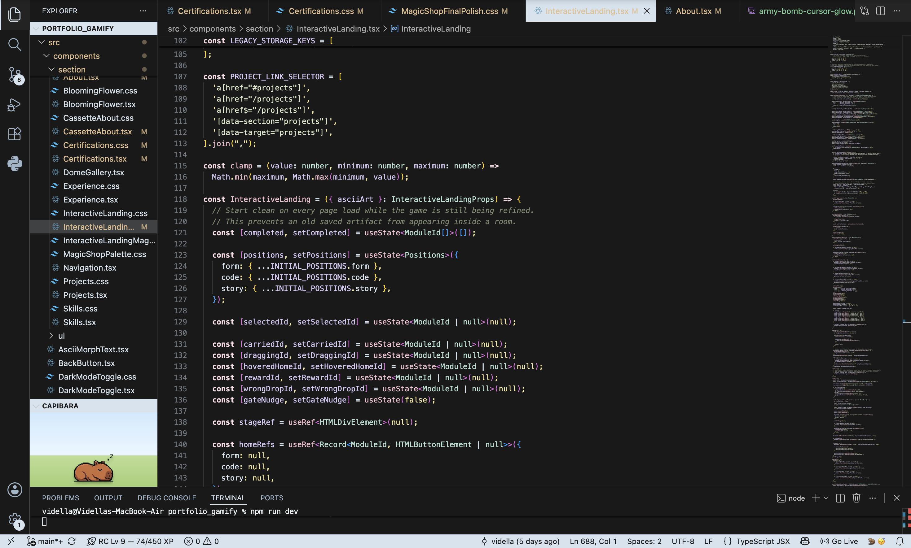

# ☁️ Sea Salt Matcha

A soothing pastel VS Code theme inspired by sea salt and matcha.

Featuring creamy baby blue with subtle matcha green accents, Sea Salt Matcha is designed to be soft, refreshing, and gentle on the eyes for comfortable coding throughout the day.

---

## ✨ Features

- ☁️ Soft baby blue UI accents
- 🍵 Gentle matcha green highlights
- 🌙 Calm dark background for reduced eye strain
- 💙 Pastel syntax highlighting for better readability
- 🧈 Butter yellow constants and numbers
- 💜 Soft lavender variables
- 💻 Designed for comfortable everyday coding

---

## 🎨 Color Palette

| Color | Hex |
| :--- | :--- |
| Background | `#191919` |
| Sea Salt Blue | `#D5E3EE` |
| Matcha Green | `#DBE9CA` |
| Lavender | `#D8C7F4` |
| Butter Yellow | `#F5E7A1` |

---

## 📦 Installation

1. Open **Extensions** in Visual Studio Code.
2. Search for **Sea Salt Matcha**.
3. Click **Install**.
4. Open **Preferences → Color Theme**.
5. Select **Sea Salt Matcha**.

---

## 🌊 Inspiration

Sea Salt Matcha was inspired by the calming colours of the ocean and the soft tones of matcha. The goal was to create a theme that feels light, cozy, and easy on the eyes while maintaining enough contrast for everyday coding.

---

## 🔗 Links

- 🛍️ **VS Code Marketplace**  
  https://marketplace.visualstudio.com/items?itemName=tipandtale.sea-salt-matcha

- 💻 **GitHub**  
  https://github.com/vidella/sea-salt-matcha

---

## ❤️ Support

If you enjoy using **Sea Salt Matcha**, please consider:

- ⭐ Starring the repository on GitHub
- 🛍️ Leaving a rating on the VS Code Marketplace
- 💙 Sharing it with fellow developers

It really helps support the project!

---

Made with ☁️ by <strong>tipandtale</strong>
